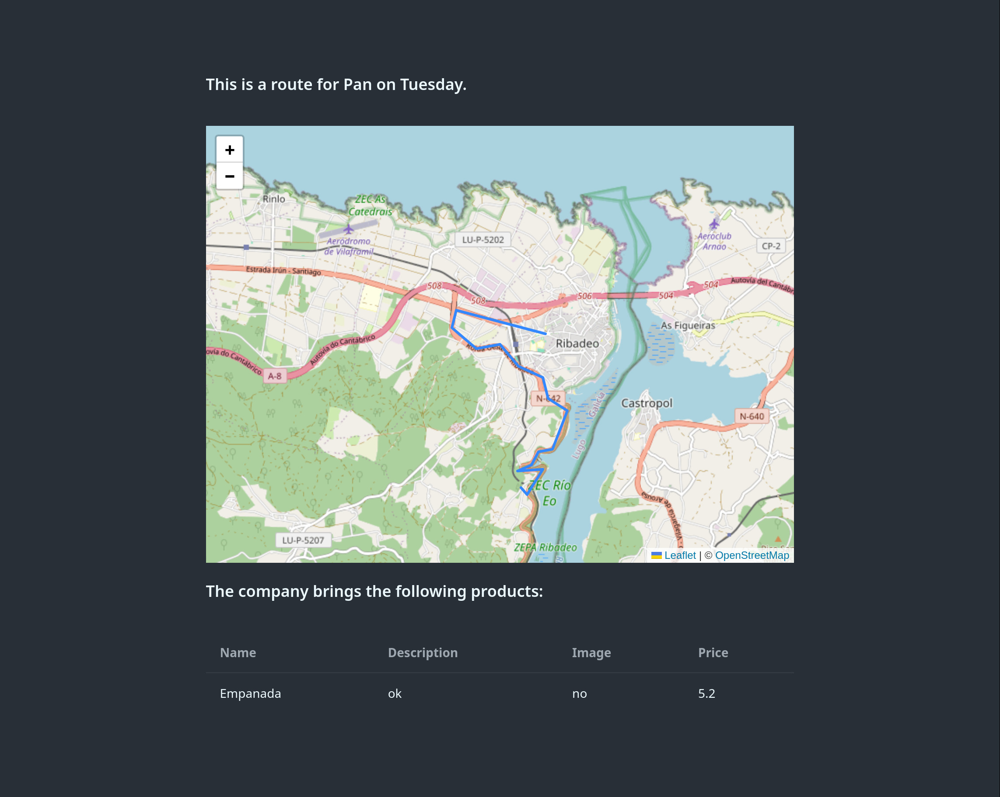
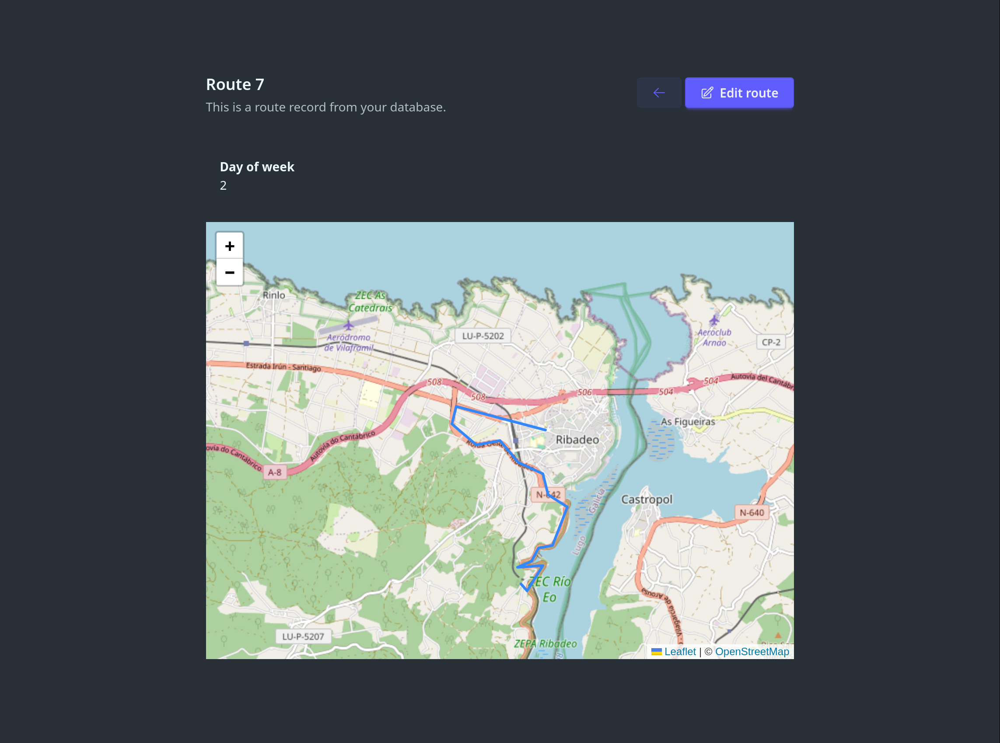
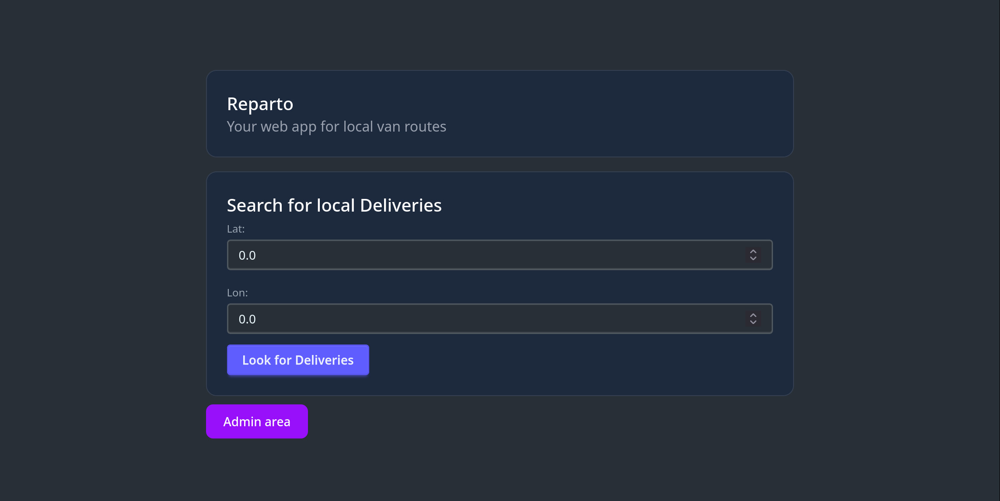

# Reparto

This is a prototype for covering a very specific use case where there are predefined delivery routes and people would like to know the closest ones and see the products they bring.

It has been developed on Elixir and Phoenix as a learning exercise.

## Problem description

In rural areas with low population density, like my home region Galicia, it is unfeasible to have food delivery services, as distances are too big to cover enough people. At the same time, there are lots of elderly people that cannot drive.

The traditional solution to this is to have a periodical delivery service, where different businesses drive their vans along predefined routes and leave their produce at the same locations every few days. This has been a great solution, but with the local people dying, it is starting to be less profitable.

Quite often the existing population gets replaced with people that only visit during the holiday period or with touristic rental properties. These cannot adapt to the existing methods, as they'd only need food or products delivered once or twice, not every week.

## Functionality

In this prototype, it would be possible to add different companies, where each could define their routes and products. When a user wants something, they could check their location and would get a list of the closest delivery routes and the days of the week they are avaliable.

### Remaining steps

This is a very barebones prototype where only some of the identified features are currently implemented

- [x] company and products management
  - [ ] Image upload and management
- [x] GeoJSON delivery route definition
  - [ ] Visual route definition and edition
  - [ ] GPX file upload for toue
- [x] User management
  - [x] Simplistic authentication and access control
  - [ ] Per user company edition rights
  - [ ] Customer management
  - [ ] Basket management and live reporting to companies

## Running the project

To start the application server in development mode:

* Install and run PosgreSQL with PostGis extension or do `docker compose up`
* Run `mix setup` to install and setup dependencies
* Run `mix ecto.create` to create the database
* Run `mix ecto.migrate` to create the tables in the database
* Start Phoenix endpoint with `mix phx.server` or inside IEx with `iex -S mix phx.server`

Now you can visit [`localhost:4000`](http://localhost:4000) from your browser.
